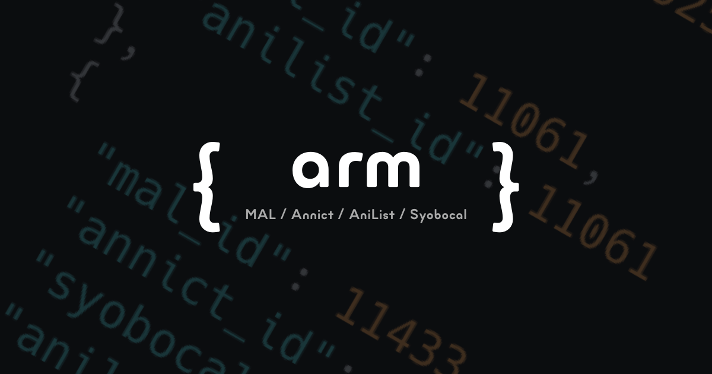

# arm

@kawaiioverflow/arm is a JSON-based database to relational mapping Anime ID's between MAL, Annict, AniList and Syobocal.

It's available as an npm package and is updated once a week.

## Support services

- MyAnimeList (MAL)
- Annict
- AniList
- Syoboi Calendar (Syobocal)

<small>We plan to support Kitsu in the future.</small>

## Usage

Install package.

```shell
$ npm i @kawaiioverflow/arm
```

`import` and use this.

```ts
import { database } from '@kawaiioverflow/arm'

console.log(database)
```

## Structure

Return an array of `Anime` type. (Return `Anime[]`)

### Anime type

Expressed in TypeScript, it looks like the following type.

```ts
type Anime = {
  mal_id?: number
  annict_id?: number
  anilist_id?: number
  syobocal_tid?: number
}
```

<small>Note that the id of syobocal is tid.</small>

### Example

```json
[
  {
    "mal_id": 5114
  },
  {
    "mal_id": 9253,
    "annict_id": 865,
    "syobocal_tid": 2142,
    "anilist_id": 9253
  },
  {
    "mal_id": 11061,
    "anilist_id": 11061
  },
  .
  .
  .
]
```

## Versioning

- Major: Add breaking change
- Minor: Update database, Add new feature (No breaking change)
- Patch: Fix database, Fix bug

---

<small>Inspired by <a href="https://github.com/manami-project/anime-offline-database">manami-project/anime-offline-database</a>.</small>
